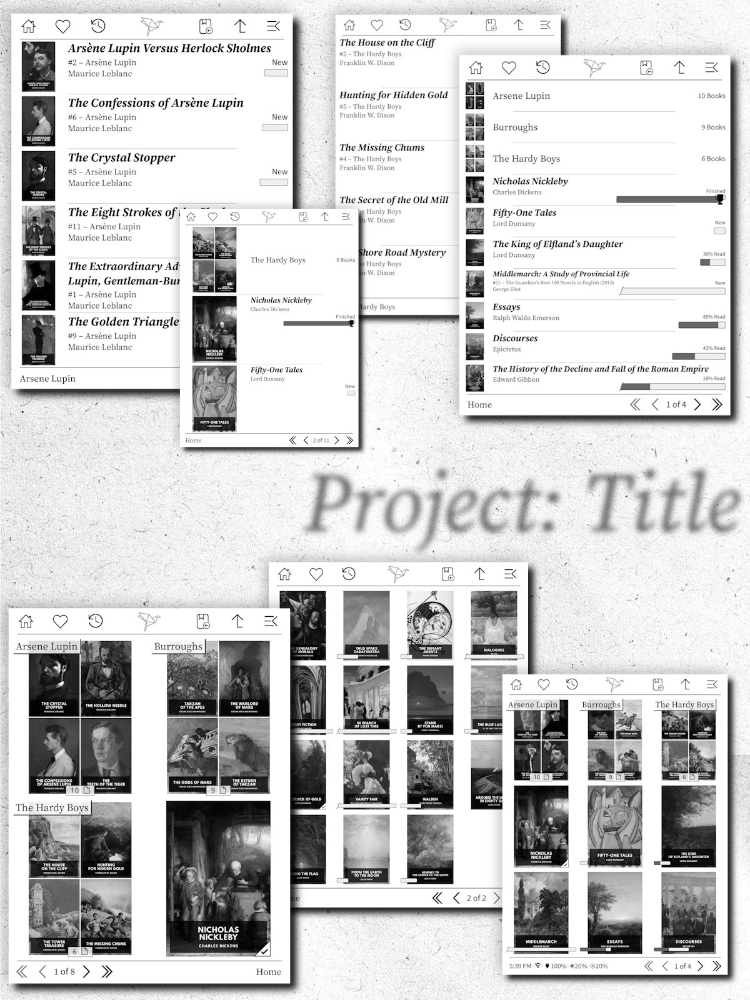

 
A collage of screenshots showing KOReader with Project: Title installed demonstrating a variety of possible display settings. 
The books used are from the Standard Ebooks collection and the text visible is part of their cover design, not overlaid by this plugin. 

#### A new view for KOReader, based on Cover Browser.
Project: Title is a project by two people who love KOreader but wanted to expand upon the Cover Browser plugin. We desired an interface that would blend in with the very best that commercial eReaders have. Something that would make the time between books, looking for that next read, as pleasant as possible.

## Features
* **A Speedy Title Bar**: Thinner with more functionality — adding Favorites, History, Open Last Book, and Up Folder buttons to help you get exactly where you need as fast as possible.

* **A Fresh Book Listing**: New fonts, new text, new icons for books without covers and unsupported files. An [optional](../../wiki/Configure-Calibre-Page-Counts) progress bar that shows the relative length of each book in lieu of just a raw percentage. Books are presented in a tasteful, distinct manner that adjusts to the screen size and how many items are on screen.

* **A Fitting Folder**: Folders no longer show slashes in their names, and instead are shown your choice of cover image, thumbnails, or a generic icon. The arrow to move up a folder has been moved up into the title bar, to give more space for your books.

* **An Informative Footer**: Shows the page controls and your choice of either the current folder or a device status bar showing time, wifi, battery, and frontlight states. The location of the page controls can be set to either the lower right or the lower left.

* **A Matching Book Status Page**: The default book status page (available as a screensaver) have been updated to show the book's description and your current progress, as well as having its design updated to match the new book listings. A setting is available to restore the original one, if needed.

* **A Few Nice Extras**: Autoscan for new books on USB eject, make list and grid items larger or smaller with gestures (pinch/spread), a trophy icon to mark finished books, and more (I think).

## Who this (hopefully) is for:
* Kobo device owners. We designed this on two Kobos (Aura One, Sage) so we feel pretty confident about the experience there.
* Jailbroken Kindle owners. Version 2025.04v1 added support and we've seen and heard from many Kindle owners running this plugin.
* Android owners. As of version 2025.04v2, the Android edition of KOReader is supported.
* Owners of Pocketbook, Boox, Bigme and more should work just as well now, too. (But let us know if you have issues.)
* Calibre users. We both sync books using Calibre, and at least one feature (the book-sized progress bars) requires Calibre and a plugin.
* People with tidy EPUB/PDF libraries. We make sure every EPUB we sync has a title, author, series and cover image, so we designed around books always having that metadata.
* Readers who like browsing for their next book and being able to see how long a book is before starting it.

## Who this (probably) is not for:
* KOReader users who prefer a barebones UI. If you are happy picking your next read from a list of filenames then KOReader already does this extremely well! However, a "filenames only" display mode is included as of version 2025.08v3.5, if you want to use the other aspects of the plugin.
* People who absolutely love one of the features we removed from Cover Browser. We made this plugin for ourselves by adding and also removing. We didn't remove much, but someone is bound to miss one of the things we took out or changed.

## Installation & Instructions
**To Download:** Visit the [Releases Page](../../releases) and find the version of Project: Title that exactly matches the version of KOReader you want to use. Not all versions of KOReader are supported or will be supported. If you upgrade KOReader, you will need to upgrade Project: Title, and if there is no version of Project: Title yet for that version, it will be blocked from loading. You would then have to choose between downgrading KOReader or waiting for an update from us.

**To install the plugin on your eReader:**
[Installation Wiki Page](../../wiki/Installation)

**To configure Calibre to add page counts to books:**
[Calibre Page Counts Wiki Page](../../wiki/Configure-Calibre-Page-Counts)

**Documentation (including hidden Title Bar functions!)**
[Project: Title Documentation](../../wiki/Documentation)

**To uninstall the plugin:** To disable Project: Title open the plugins menu and re-enable Cover Browser then restart your device. You could also delete the projecttitle.koplugin folder from your device. You can then delete the additional fonts and icons, check the install steps for a reminder on where you placed them.

## Credits
All code here started life as the Cover Browser plugin, written by @poire-z and other members of the KOReader team. The additional changes made here were done by @joshuacant and @elfbutt

## Licenses
The code is licensed under the same terms as KOReader itself, AGPL-3.0. The license information for any additional files (fonts, images, etc) is located in licenses.txt
